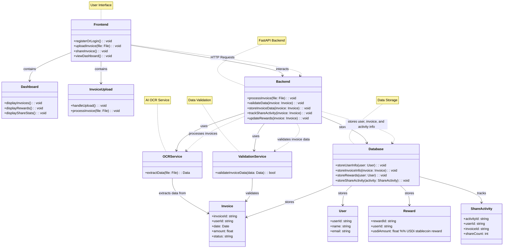

```mermaid
classDiagram
    %% Frontend Components
    class Frontend {
        +registerOrLogin(): void
        +uploadInvoice(file: File): void
        +shareInvoice(): void
        +viewDashboard(): void
    }

    class Dashboard {
        +displayInvoices(): void
        +displayRewards(): void
        +displayShareStats(): void
    }

    class InvoiceUpload {
        +handleUpload(): void
        +processInvoice(file: File): void
    }

    %% Backend Components
    class Backend {
        +processInvoice(file: File): void
        +validateData(invoice: Invoice): void
        +storeInvoiceData(invoice: Invoice): void
        +trackShareActivity(invoice: Invoice): void
        +updateRewards(invoice: Invoice): void
    }

    class OCRService {
        +extractData(file: File): Data
    }

    class ValidationService {
        +validateInvoiceData(data: Data): bool
    }

    class Database {
        +storeUserInfo(user: User): void
        +storeInvoiceInfo(invoice: Invoice): void
        +storeRewards(user: User): void
        +storeShareActivity(activity: ShareActivity): void
    }

    %% Entities
    class Invoice {
        +invoiceId: string
        +userId: string
        +date: Date
        +amount: float
        +status: string
    }

    class User {
        +userId: string
        +name: string
        +email: string
    }

    class ShareActivity {
        +activityId: string
        +userId: string
        +invoiceId: string
        +shareCount: int
    }

    class Reward {
        +rewardId: string
        +userId: string
        +usdiAmount: float  %% USDi stablecoin reward
    }

    %% Relationships
    Frontend --> InvoiceUpload : contains
    Frontend --> Dashboard : contains
    Frontend --> Backend : interacts
    Backend --> OCRService : uses
    Backend --> ValidationService : uses
    Backend --> Database : stores data
    OCRService --> Invoice : extracts data from
    ValidationService --> Invoice : validates
    Database --> User : stores
    Database --> Invoice : stores
    Database --> Reward : stores
    Database --> ShareActivity : tracks

    %% Integration
    Frontend ..> Backend : HTTP Requests
    Backend ..> OCRService : processes invoices
    Backend ..> ValidationService : validates invoice data
    Backend ..> Database : stores user, invoice, and activity info

    note for Frontend "User Interface"
    note for Backend "FastAPI Backend"
    note for OCRService "AI OCR Service"
    note for ValidationService "Data Validation"
    note for Database "Data Storage"
```
